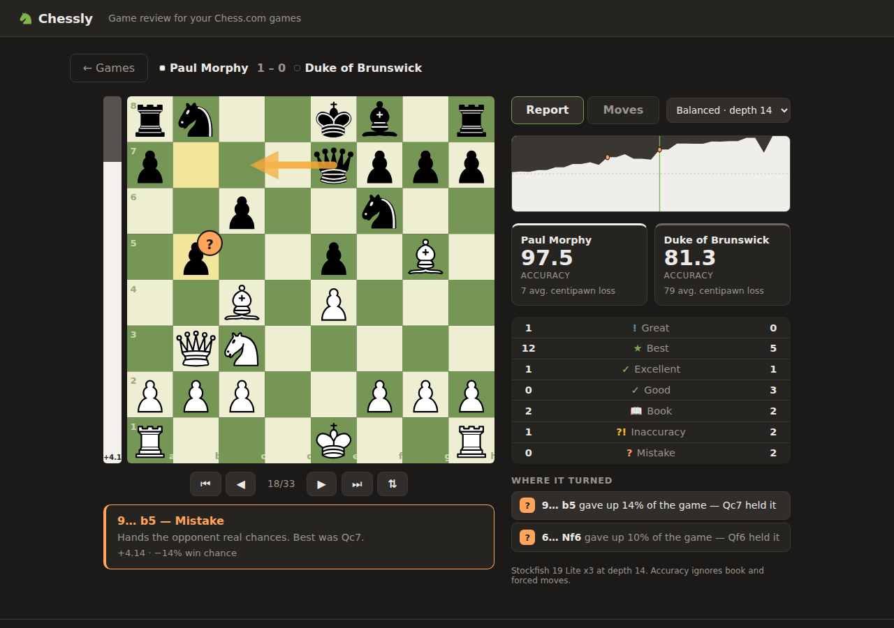

# Chessly

Game review for your Chess.com games. Type a username, pick a game, and every
move gets an engine evaluation and a verdict — brilliant, great, best, book,
inaccuracy, mistake, blunder — plus accuracy, an evaluation graph and the move
you should have played instead.

Stockfish runs in your browser as a Web Worker. Nothing is uploaded, there is no
backend, and games come straight from the public Chess.com API.



## Running it

```bash
npm install     # also copies the Stockfish build into public/engine
npm run dev     # http://localhost:5173
```

Other scripts:

| command | what it does |
| --- | --- |
| `npm run build` | type-checks and builds into `dist/` |
| `npm run preview` | serves the production build |
| `npm test` | unit tests for the scoring and classification logic |
| `npm run analyze -- "<pgn>" [fast\|balanced\|deep]` | analyses a game in the terminal |

## Putting it on your phone

The build uses relative asset paths, so `dist/` works at a domain root, in a
subfolder, or anywhere else you drop it. The only requirement is that `.wasm`
files are served as `application/wasm`, which every mainstream static host does
by default.

**GitHub Pages.** `.github/workflows/pages.yml` builds and deploys on every push
to `main` or the working branch. Turn it on once under *Settings → Pages →
Source: GitHub Actions*; the site then lives at
`https://<user>.github.io/<repo>/` and works on any phone.

**Any static host.** `npm run build`, then upload the `dist/` folder — Netlify
Drop, Cloudflare Pages, Vercel, S3, a Raspberry Pi. No server-side anything.

**Straight off your laptop, same Wi-Fi.** `npm run dev -- --host` prints a
`Network:` URL like `http://192.168.1.20:5173/`. Open that on your phone.

A phone runs the analysis fine — the engine pool shrinks to two workers on
devices reporting 4GB of memory or less. Swipe across the board to step through
the moves.

## How the analysis works

Each position in the game is searched with `MultiPV 2`, so for every move we
know both what was played and what the engine preferred. The evaluation after a
move comes from the search of the next position, which keeps the two numbers on
the same footing.

### Depth

The slider sets the depth verdicts are made at, from 8 to 24. Below 15 the whole
game is searched uniformly at that depth. From 15 up it runs in two passes:

1. **Scan.** Every position at depth 12, two lines wide — cheap, and the
   runner-up line is what says whether a move was the only one that held.
2. **Closer look.** One line only, at full depth, for the moves the scan found
   something in: anything that cost 2% or more of the game, any position where
   the runner-up was far behind, and any material offer. Both ends of such a
   move are re-searched together, so a verdict is never a deep evaluation
   compared against a shallow one, and each move records the depth it rests on.

Three things keep it quick, each measured rather than assumed:

- **The second pass is capped** at 35% of the positions, ranked by what each
  move cost. The positions that need depth are the tactical ones, which are also
  the slowest to search, so an uncapped second pass on a sharp game re-searched
  three quarters of it and came out *slower* than searching everything uniformly.
- **The deep pass searches one line, not two.** A second line costs about a
  third more and the only thing it adds — whether the alternative was much worse
  — the scan already answered on a search where both numbers came from the same
  place.
- **Every search has a node ceiling** that doubles every two plies of depth. A
  tenth of the positions in a game were taking half the total time; their
  verdicts barely move.

One exception overrides the cap: a move that offers material, which the shallow
pass rated as fine and which came from a position still live enough to be
brilliant, always gets the full-depth search. There are only a handful per game
(nine in the 45-move game below) but they are the most expensive positions to
search, and judging them shallowly is how a brilliancy gets quietly recorded as
an ordinary move.

Measured on one 45-move game, four-core laptop, three engines:

| depth | before this work | now |
| --- | --- | --- |
| 14 | 13.2s | 11.9s |
| 16 | 33.9s | 12.7s |
| 18 | 49.1s | 32.2s |
| 20 | — | 62.3s |
| 24 | — | 175.8s |

Depth 18 gave up about ten of those seconds when sacrifices were promoted past
the cap, which is what it costs to have brilliancies found rather than guessed
at.

On a tactical game checked move by move against a uniform depth-18 search,
every mistake, blunder, missed win and brilliancy came out identical.

Phones default to depth 16 rather than 18 and run up to four engines; desktops
run up to six. One thing worth knowing: nominal depth is not a promise of a
specific number. Searching the same position to depth 18 with a different
transposition-table history can return a different evaluation, and on genuinely
sharp positions that occasionally moves a verdict. Depth buys confidence, not
determinism.

**Classification** is driven by how much win percentage a move gives up:

| verdict | rule |
| --- | --- |
| Book | the move is still in the opening book (`src/lib/openings.ts`) |
| Forced | it was the only legal move |
| Brilliant | gives up at least 1.8 pawns of material beyond recapture, is still the engine's choice, and keeps the game at least level — and the player was not already winning |
| Great | the only move that changes the standing of the game; every alternative is at least 20% worse |
| Best | the engine's first choice |
| Excellent / Good | gives up under 2% / under 5% |
| Inaccuracy / Mistake / Blunder | under 10% / under 20% / 20% or more |
| Miss | a win or a mate was on the board and went by, but the game is not lost |

Sacrifices are detected with a static exchange evaluation over legal moves
(`src/lib/see.ts`), so a recapture-in-disguise does not count as a sacrifice.

**Accuracy** uses Lichess's per-move curve, combined into a game figure as the
mean of a volatility-weighted mean and a harmonic mean — the weighting stops
quiet, decided positions from inflating the number, and the harmonic mean stops
one blunder from being averaged away. Book and forced moves are excluded: they
were never a decision. The "level" beside the accuracy is a rough calibration
against online play, shown only when there are enough real decisions to judge.

**Speed.** Several single-threaded engines run side by side (one position each)
rather than one multi-threaded engine, which is faster for this workload and
avoids needing cross-origin isolation headers. A 40-move game takes a few
seconds on Fast and around half a minute on Deep. Finished reports are cached in
`localStorage`, so reopening a game is instant.

## Layout

```
src/lib/        engine worker, Chess.com client, analysis pipeline, scoring
src/components/ board, eval bar, eval graph, move list, report, screens
tools/          terminal analyser and browser smoke test
tests/          unit tests for the scoring rules
```

## Credits

Stockfish 19 (GPLv3), [stockfish.js](https://github.com/nmrugg/stockfish.js),
[chess.js](https://github.com/jhlywa/chess.js), and the cburnett piece set by
Colin M. L. Burnett. See [LICENSES.md](LICENSES.md).

Not affiliated with Chess.com.
